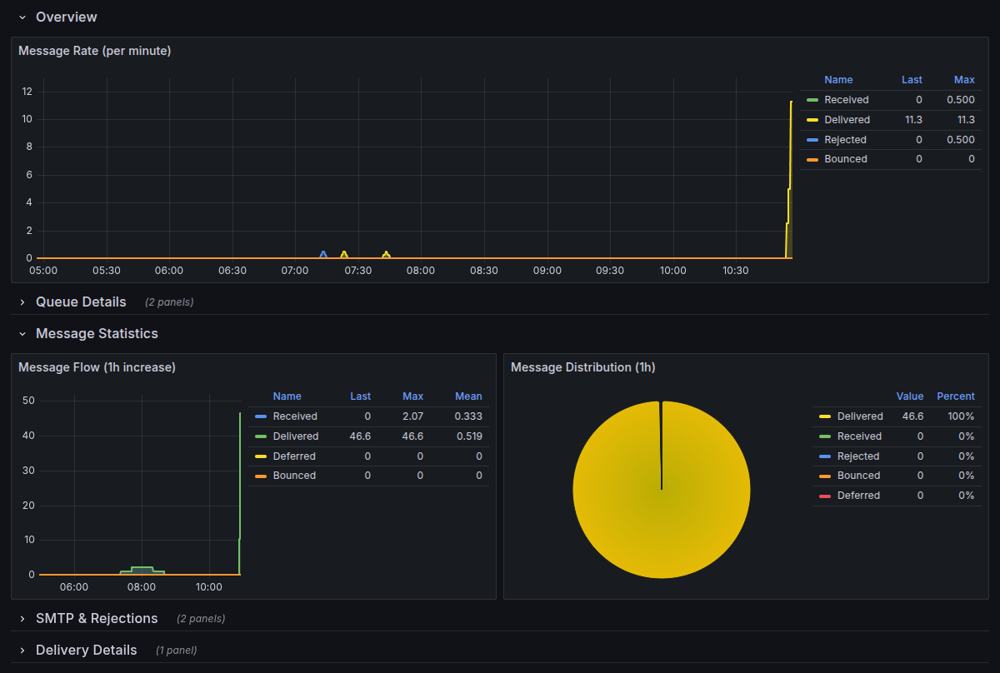

# Postfix Prometheus Exporter

A lightweight, bash-based Prometheus exporter for Postfix mail server statistics. This exporter uses only bash and socat to provide comprehensive Postfix metrics for monitoring with Prometheus and Grafana.

## Features

- **Pure Bash Implementation**: No external dependencies except `socat`
- **Comprehensive Metrics**: Exports Postfix statistics including:
  - Queue sizes (active, deferred, incoming, hold, maildrop, corrupt)
  - Message counters (received, delivered, forwarded, deferred, bounced, rejected)
  - SMTP connection statistics and SASL authentication
  - Rejection reasons (RBL, HELO, sender, recipient, client, unknown user)
  - Delivery status by transport (smtp, lmtp, virtual, pipe)
  - Process status and uptime
  - Postfix version information
- **Stateful Counter Tracking**: Maintains persistent counters for accurate Prometheus rate calculations
- **HTTP Server**: Built-in HTTP server using socat for serving metrics
- **Systemd Integration**: Ready-to-use systemd service file
- **Grafana Dashboard**: Pre-built comprehensive dashboard
- **Multi-Instance Support**: Monitor multiple Postfix servers

## Quick Start

### Prerequisites

- Postfix mail server
- `socat` package installed
- Prometheus server for scraping metrics
- Read access to Postfix logs and queue directory

### Basic Installation

1. Clone the repository:
```bash
git clone https://github.com/itefixnet/prometheus-postfix-exporter.git
cd prometheus-postfix-exporter
```

2. Make scripts executable:
```bash
chmod +x *.sh
```

3. Test the exporter:
```bash
sudo ./postfix-exporter.sh test
```

4. Start the HTTP server:
```bash
sudo ./http-server.sh start
```

5. Access metrics at `http://localhost:9154/metrics`

### System Installation

For production deployment, install as a system service:

```bash
# Create user and directories
sudo useradd -r -s /bin/false postfix-exporter
sudo mkdir -p /opt/postfix-exporter
sudo mkdir -p /var/lib/postfix-exporter

# Copy files
sudo cp *.sh /opt/postfix-exporter/
sudo cp config.sh /opt/postfix-exporter/
sudo cp postfix-exporter.conf /opt/postfix-exporter/
sudo cp postfix-exporter.service /etc/systemd/system/

# Set permissions
sudo chown -R postfix-exporter:postfix-exporter /opt/postfix-exporter
sudo chown -R postfix-exporter:postfix-exporter /var/lib/postfix-exporter
sudo chmod +x /opt/postfix-exporter/*.sh

# Add user to adm group for log access
sudo usermod -a -G adm postfix-exporter

# Enable and start service
sudo systemctl daemon-reload
sudo systemctl enable postfix-exporter
sudo systemctl start postfix-exporter

# Check status
sudo systemctl status postfix-exporter
```

## Configuration

### Environment Variables

The exporter can be configured using environment variables or configuration files:

| Variable | Default | Description |
|----------|---------|-------------|
| `POSTFIX_LOG` | `/var/log/mail.log` | Path to Postfix log file |
| `POSTFIX_QUEUE_DIR` | `/var/spool/postfix` | Path to Postfix queue directory |
| `LISTEN_PORT` | `9154` | HTTP server port |
| `LISTEN_ADDRESS` | `0.0.0.0` | HTTP server bind address |
| `METRICS_PREFIX` | `postfix` | Prometheus metrics prefix |
| `LOG_LINES` | `10000` | Number of log lines to parse on first run |
| `STATE_FILE` | `/var/lib/postfix-exporter/state` | State file for persistent counters |
| `MAX_CONNECTIONS` | `10` | Maximum concurrent HTTP connections |
| `TIMEOUT` | `30` | Request timeout in seconds |

**How it works**: The exporter maintains persistent counters in a state file, tracking the log file position (inode and byte offset). On each scrape, it:
1. Reads only new log entries since the last position
2. Parses all metrics (messages, SMTP connections, rejections, deliveries) in a single pass
3. Increments the appropriate counters in memory
4. Saves the updated state (counters and position) to disk

This architecture ensures counters monotonically increase as required by Prometheus, enabling accurate `rate()` and `increase()` calculations. Log rotation and truncation are automatically detected and handled. All log parsing is consolidated in the `parse_log_direct()` function to prevent position conflicts and ensure data consistency.

### Configuration Files

1. **`config.sh`**: Shell configuration file (sourced by scripts)
2. **`postfix-exporter.conf`**: Systemd environment file

## Metrics

The exporter provides comprehensive Postfix mail server metrics:

### Process Status
- `postfix_master_process_running` - Postfix master process status (1=running, 0=not running)
- `postfix_master_process_uptime_seconds` - Postfix master process uptime in seconds (counter)
- `postfix_version_info{version="..."}` - Postfix version information with label

### Queue Metrics
- `postfix_queue_size{queue="incoming"}` - Number of messages in incoming queue
- `postfix_queue_size{queue="maildrop"}` - Number of messages in maildrop queue
- `postfix_queue_size{queue="active"}` - Number of messages in active queue
- `postfix_queue_size{queue="deferred"}` - Number of messages in deferred queue
- `postfix_queue_size{queue="hold"}` - Number of messages in hold queue
- `postfix_queue_size{queue="corrupt"}` - Number of messages in corrupt queue

### Message Statistics
- `postfix_messages_received_total` - Total number of messages received (counter)
- `postfix_messages_delivered_total` - Total number of messages delivered (counter)
- `postfix_messages_forwarded_total` - Total number of messages forwarded (counter)
- `postfix_messages_deferred_total` - Total number of messages deferred (counter)
- `postfix_messages_bounced_total` - Total number of messages bounced (counter)
- `postfix_messages_rejected_total` - Total number of messages rejected (counter)

### SMTP Connection Statistics
- `postfix_smtpd_connections_total` - Total SMTP connections (counter)
- `postfix_smtpd_noqueue_total` - Total NOQUEUE rejections (counter)
- `postfix_smtpd_sasl_authenticated_total` - Total SASL authenticated sessions (counter)
- `postfix_smtpd_sasl_failed_total` - Total SASL authentication failures (counter)

### Rejection Statistics
- `postfix_smtpd_reject_total{reason="rbl"}` - SMTP rejections due to RBL (counter)
- `postfix_smtpd_reject_total{reason="helo"}` - SMTP rejections due to HELO (counter)
- `postfix_smtpd_reject_total{reason="sender"}` - SMTP rejections due to sender (counter)
- `postfix_smtpd_reject_total{reason="recipient"}` - SMTP rejections due to recipient (counter)
- `postfix_smtpd_reject_total{reason="client"}` - SMTP rejections due to client (counter)
- `postfix_smtpd_reject_total{reason="unknown_user"}` - SMTP rejections due to unknown user (counter)

### Delivery Statistics
- `postfix_delivery_status_total{transport="smtp",status="sent"}` - Deliveries via SMTP (counter)
- `postfix_delivery_status_total{transport="lmtp",status="sent"}` - Deliveries via LMTP (counter)
- `postfix_delivery_status_total{transport="virtual",status="sent"}` - Deliveries via virtual transport (counter)
- `postfix_delivery_status_total{transport="pipe",status="sent"}` - Deliveries via pipe transport (counter)

## Usage Examples

### Manual Testing

```bash
# Test connection to Postfix
sudo ./postfix-exporter.sh test

# Collect metrics once
sudo ./postfix-exporter.sh collect

# Start HTTP server manually
sudo ./http-server.sh start

# Test HTTP endpoints
curl http://localhost:9154/metrics
curl http://localhost:9154/health
curl http://localhost:9154/
```

### Prometheus Configuration

Add jobs to your `prometheus.yml` for single or multiple Postfix instances:

```yaml
scrape_configs:
  # Single instance
  - job_name: 'postfix-exporter'
    static_configs:
      - targets: ['localhost:9154']
    scrape_interval: 30s
    metrics_path: /metrics
    
  # Multiple instances with labels
  - job_name: 'postfix-servers'
    static_configs:
      - targets: ['mail1.example.com:9154', 'mail2.example.com:9154']
        labels:
          environment: 'production'
          datacenter: 'dc1'
      - targets: ['staging.example.com:9154']
        labels:
          environment: 'staging' 
          datacenter: 'dc2'
    scrape_interval: 30s
    metrics_path: /metrics
```

### Grafana Dashboard

Import the provided `grafana-dashboard.json` file into your Grafana instance:

1. Go to Dashboards → Import
2. Upload `grafana-dashboard.json` or copy/paste the JSON content
3. **Configure Data Source**: Select your Prometheus datasource from the dropdown
4. Click "Import"

**Troubleshooting Dashboard Import:**
- If you get "data source was not found" error, ensure your Prometheus datasource is properly configured in Grafana
- Make sure your Prometheus is scraping the Postfix exporter endpoints
- Verify metrics are available by checking: `http://your-grafana/explore` → Select Prometheus → Query `postfix_master_process_running`

**Dashboard Features:**

The comprehensive Grafana dashboard includes:

- **Overview Row**:
  - Message Rate panel (received, delivered, rejected, bounced per minute) - 20 columns wide
  - Uptime panel - compact 4x4 display with color-coded thresholds

- **Queue Details Row**:
  - Queue Size by Type (stacked area chart showing active, deferred, incoming, hold, maildrop)
  - Current Queue Sizes (bar gauge with color thresholds)

- **Message Statistics Row**:
  - Message Flow (1h increase) showing received, delivered, deferred, bounced
  - Message Distribution (24h pie chart with percentages)

- **SMTP & Rejections Row** (collapsed by default):
  - SMTP Connections per minute (connections, SASL authenticated, SASL failed)
  - SMTP Rejections by Reason per minute (stacked chart by reason: RBL, HELO, sender, recipient, client, unknown user)

- **Delivery Details Row** (collapsed by default):
  - Deliveries by Transport per minute (smtp, lmtp, virtual, pipe)

All panels support:
- Multi-instance filtering with template variables
- Auto-refresh (30 second default)
- Time range selection
- Drill-down capabilities

**Multi-Instance Support:**
The dashboard includes template variables for monitoring multiple Postfix instances:
- **Instance**: Filter by specific instance (e.g., `mail1.example.com:9154`, `localhost:9154`)
- **Job**: Filter by Prometheus job name

To monitor multiple instances, configure your `prometheus.yml` as shown above.

The dashboard supports:
- **Multi-Instance Monitoring**: Automatically discovers all Postfix exporters
- **Flexible Filtering**: Filter by instance (host:port) and job name
- **Multi-Select Variables**: Monitor multiple instances simultaneously
- **Instance Labeling**: All metrics show which instance they come from

## Troubleshooting

### Common Issues

1. **Permission Denied**:
   - Ensure scripts are executable: `chmod +x *.sh`
   - Add exporter user to `adm` group for log access: `sudo usermod -a -G adm postfix-exporter`
   - Check queue directory permissions

2. **Cannot Read Log File**:
   - Verify log file path: `ls -la /var/log/mail.log`
   - Check user permissions: `sudo -u postfix-exporter cat /var/log/mail.log`
   - Ensure log file exists and is readable

3. **Port Already in Use**:
   - Change `LISTEN_PORT` in configuration
   - Check for other services: `netstat -tlnp | grep 9154`

4. **Missing Dependencies**:
   ```bash
   # Install socat (Ubuntu/Debian)
   sudo apt-get install socat
   
   # Install socat (CentOS/RHEL)
   sudo yum install socat
   ```

5. **Postfix Not Detected**:
   - Verify Postfix is running: `systemctl status postfix`
   - Check queue directory: `ls -la /var/spool/postfix`
   - Ensure postconf is available: `which postconf`

### Logging

- Service logs: `journalctl -u postfix-exporter -f`
- Manual logs: Scripts output to stderr

### Performance Tuning

For high-traffic mail servers:
- Adjust `LOG_LINES` to analyze fewer lines (faster but less accurate)
- Consider running exporter on a separate monitoring server
- Monitor system resources
- Tune scrape interval in Prometheus

## Development

### Testing

```bash
# Run basic tests
sudo ./postfix-exporter.sh test
sudo ./http-server.sh test

# Test with different configurations
POSTFIX_LOG=/var/log/maillog sudo ./postfix-exporter.sh test
```

### Contributing

1. Fork the repository
2. Create a feature branch
3. Test thoroughly
4. Submit a pull request

### License

This project is licensed under the BSD 2-Clause License - see the [LICENSE](LICENSE) file for details.

## Support

- GitHub Issues: [https://github.com/itefixnet/prometheus-postfix-exporter/issues](https://github.com/itefixnet/prometheus-postfix-exporter/issues)
- Documentation: This README and inline script comments

## Alternatives

This exporter focuses on simplicity and minimal dependencies. For more advanced features, consider:
- [postfix_exporter](https://github.com/kumina/postfix_exporter) (Go-based)
- Custom telegraf configurations
- Native Prometheus monitoring solutions

## Credits

Inspired by the [prometheus-apache2-exporter](https://github.com/itefixnet/prometheus-apache2-exporter) project.

## Related Projects

- [prometheus-apache2-exporter](https://github.com/itefixnet/prometheus-apache2-exporter) - Apache HTTP server exporter